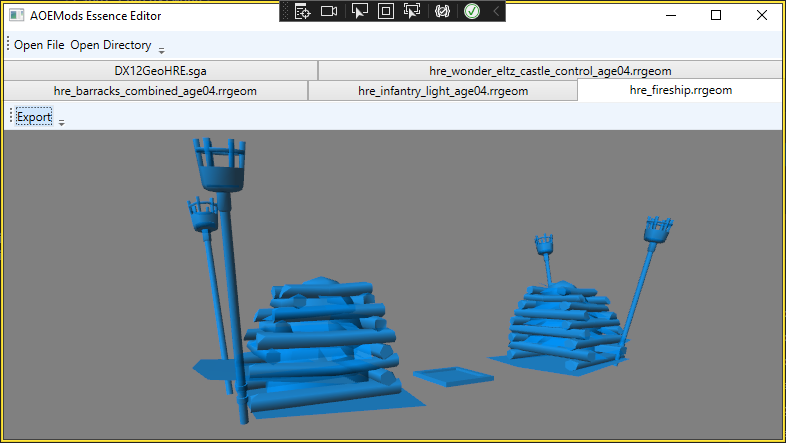

# AOEMods.Essence
**Work in progress**

C# library and tools for working with Age of Empire 4's Essence engine.

Join the AOE4 modding discord for information sharing, discussions or if you need help: https://discord.gg/h8FX9Uq3vG

## Download
See [Releases page](https://github.com/aoemods/AOEMods.Essence/releases) for downloads.

## Screenshots
**Load an sga archive, convert/export an rrtex file within it**

## Usage
A number of Age of Empires 4 / Essence formats are supported right now and more are being worked on.

### Supported formats
- sga: Read, Convert (unpack into directory), Write
- rrtex: Read, Convert (most common image formats)
- rrgeom: Read (vertex positions, normals, texture coordinates and faces), Convert (obj)
- rgd: Read, Convert (json)

### Editor
The editor can open sga archives, folders that act as sga archives and individual files.
After opening an archive or folder, files can be mass-exported and mass-converted. The archive
can also be edited, for example adding / renaming / removing files, and saved as an sga file again.

### CLI
The CLI has multiple commands. You can get the full description and list of parameters by running them without any parameters or by passing `--help`.
- `rrtex-decode <input-path> <output-path>`: Converts a `.rrtex` file to an image (supported extensions are `.png, .jpg, .bmp, .tga, .gif`), pass `-b` to treat paths as folders and convert all files
- `rrgeom-decode <input-path> <output-path>`: Converts a `.rrgeom` file to `.obj`, pass `-b` to treat paths as folders and convert all files
- `rgd-decode <input-path> <output-path>`: Converts a `.rgd` file to `.json`, pass `-b` to treat paths as folders and convert all files
- `sga-pack <input-path> <output-path> <archive-name>`: Packs the input directory into a `.sga` archive
- `sga-unpack <input-path> <output-path>`: Unpacks a `.sga` archive into a folder

## Projects
- AOEMods.Essence: Library for working with AOE4's files
- AOEMods.Essence.CLI: Command line interface for working with AOE4's files
- AOEMods.Essence.Editor: Graphical user interface for working with AOE4's files
