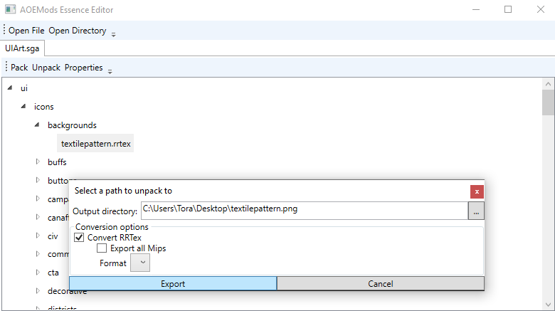

# AOEMods.Essence
**Work in progress**

C# library and tools for working with Age of Empire 4's Essence engine.

Join the AOE4 modding discord for information sharing, discussions or if you need help: https://discord.gg/h8FX9Uq3vG

## Download
See [Releases page](https://github.com/aoemods/AOEMods.Essence/releases) for downloads.

## Screenshots
** Load an sga archive, convert/export an rrtex file within it **

## Usage
A number of Age of Empires 4 / Essence formats are supported right now and more are being worked on.

### Supported formats
- sga: Read, Convert (unpack into directory), Write
- rrtex: Read, Convert (most common image formats)
- rgd: Read, Convert (json)

### Editor
The editor can open sga archives, folders that act as sga archives and individual files.
After opening an archive or folder, files can be mass-exported and mass-converted. The archive
can also be edited, for example adding / renaming / removing files, and saved as an sga file again.

## Projects
- AOEMods.Essence: Library for working with AOE4's files
- AOEMods.Essence.CLI: Command line interface for working with AOE4's files
- AOEMods.Essence.Editor: Graphical user interface for working with AOE4's files
